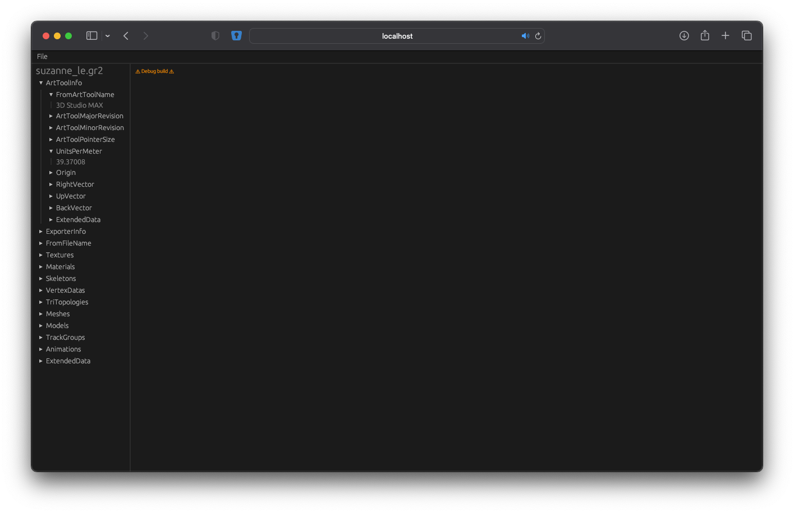

# opengr2-viewer
An open source Granny2 file viewer using ``egui``, ``eframe`` and ``opengr2``.

This project is mostly aimed to run inside a web browser.

For current support of Granny2 files look at the [feature table](https://github.com/NoFr1ends/opengr2-rs#features) of opengr2.

